###  An Analysis of the Impact of Health and Education Metrics on GDP for African Countries"

## Group Members

    1. Kenneth Karanja
    2. Ronald Kipengetich
    3. Tom Mwambire
    4. Paul Mwangi
    5. Milton Kabute
    6. Salman Yusuf

## Introduction
This project aims to predict GDP (Gross Domestic Product) based on health and education metrics. We have used linear modelling to understand how the health , education metrics impact on the GDP growth in considering which African Countries to invest in.

Axis Investment and Consultancy is a world leading Wealth management, Investment Solutions and Consultancy firm that values people are part core unit in business and have vital role in business success. Axis Investment and Consultancy are looking to invest in  business but are also cognizant to economic health (GDP per capita) of the country they are based in. They believe that the health metrics of the population of African Countries can determine if a countries are doing well economically. However, they do not have any factual  information to prove this and decide on best performing GDP in African countries. However, this project seeks to explore the best environments to invest based on the Health Factors, Education metrics as social factos that have impact on GDP growth.

Gross Domestic Product (GDP) is the standard measure of the value created by a country on the world stage through the production of goods and services throughout a given time. GDP per capita however is the sum of gross value added by all resident producers in the economy plus any product taxes (less subsidies) not included in the valuation of output, divided by mid-year population. In simpler terms, GDP per capita is a metric that shows the economic output per person. GDP and GDP per Capita are mostly calculated yearly although quarterly calculations are common though they are not as common as the yearly ones. Both GDP and GDP per capita do similar things but GDP per capita is more preferred since it considers the population of the country.

## Project Objectives

The project goal is to find the relationship between health, education, finance metrics and GDP of the African Countries. We strive to help Axis Investment and Consultancy undestand factors that have an impact on the GDP growth through visual, application of statistical models like linear regression, multiple regression and correlation coeffeficient. Furthermore, this study enlightens the investors with the following

    1. Understand factors influencing GDP- Investigate correlation between Health, education metric, financial metrics and GDP of African Countries
    2. Make informed investment stategies leverage on data insights of factors influencing GDP growth.
    3. Provide strategic advisories to clients with data driven understanding of economic growth.

### Data Source and Variables
Data Source : [Life Expectancy WHO Dataset](https://www.kaggle.com/datasets/augustus0498/life-expectancy-who/data)

Here are some key columns available in the dataset:

- `Country`: Name of the country.
- `Year`: Year of the data.
- `Status`: Development status of the country (Developed or Developing).
- `Life expectancy`
- `Adult mortality`
- `Alcohol consumption`
- `Education metrics (Schooling)`
- `Health Metric (BMI, Measles, Hiv/Aids)`
- `GDP per capita`

## Stakeholders
    1. Axis Investment and Consultancy
    2. Shareholders
    3. Advisors working Axis Investment and Consultancy
    4. Axis Investment and Consultancy Clients

## Methodology
The project employs statistical models such as linear regression, multiple regression, and correlation coefficients to understand relationships between the independent variables Life expectancY, Adult mortality, Infant deaths, Alcohol consumption, Education metrics BMI, Schooling, Health Metric BMI, Measles, Hiv/Aids and dependent variable GDP.

## Axis Investment and Consultancy Objective
1.Develop investment strategies informed by data insights accounting the health, education metrics that influence GDP.
2.Identify specific sectors in the East African Countries that can yield high returns based on correlation between health, education and financial metrics with GDP
3.Assist in mitigating risks associated with health, education metrics on labor force and overall GDP growth.
4.Market expansion in regions with East Africa that Health, education indicators suggest poetential GDP growth.
5.Client Advisories on best countries to invest.

## Hypothesis
1.Immunizaation Coverage and GDP
Null Hypothesis (H0)
There is no significant relationship  between a country’s immunization coverage and its GDP.
Alternative Hypothesis (H1): There is significant relationship between a country’s immunization coverage and its GDP

2. Alcohol Consumption and GDP:
Null Hypothesis (H0): There is no significant relationship between a country’s level of alcohol consumption and its GDP.
Alternative Hypothesis (H1): There is a significant relationship  between a country’s level of alcohol consumption and its GDP.

3.Education Level and GDP:
Null Hypothesis (H0): There is no significant  relationship between a country’s average education level and its GDP.
Alternative Hypothesis (H1): There is a positive correlation between a country’s average education level and its GDP.

4. Government Health Expenditure and GDP:
Null Hypothesis (H0): There is no correlation between the percentage of total government expenditure a country allocates to health and its GDP.
Alternative Hypothesis (H1): There is a positive correlation between the percentage of total government expenditure a country allocates to health and its GDP

## Frequency Distribution 

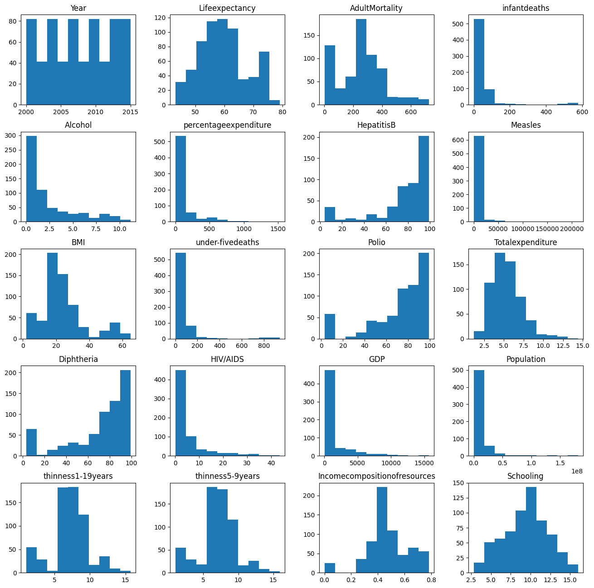

## Outliers Visuals

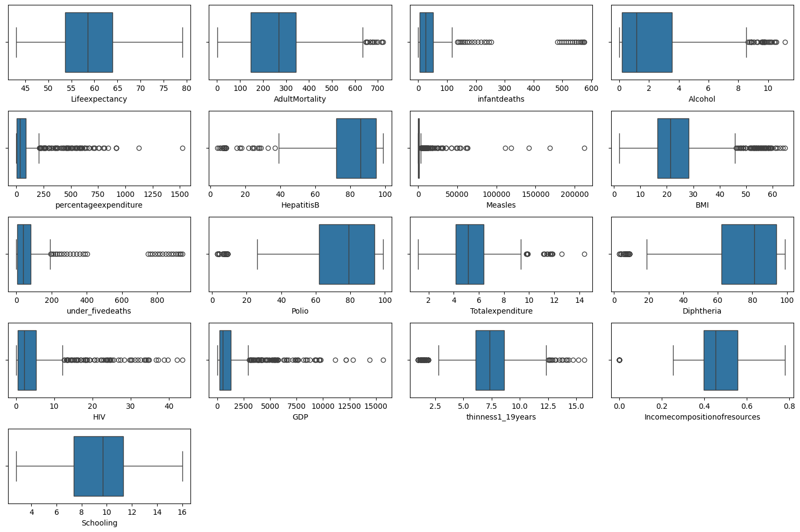

## Null Values Distribution
There are 14 columns with missing values. The column with the most missing or null values is 652 which accounts for about 22.19 percent of the total values in the dataset 

In order to greatly maximise the data that we have, we will replace the missing data with the mean values of the data columns

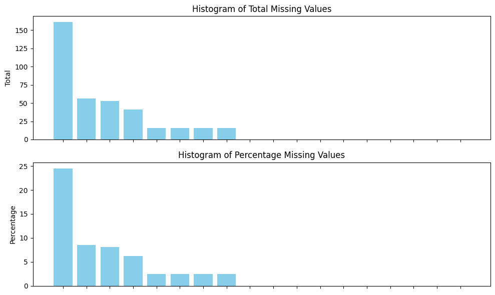

## No Missing Values Visuals
There are no missing Values after cleaning the dataset

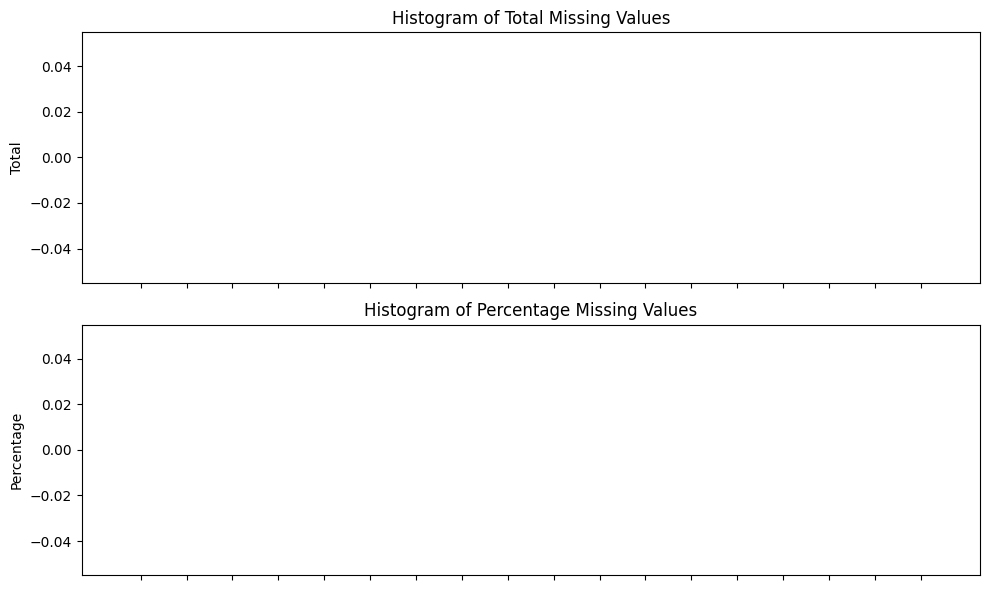

## Correlation Heatmap
The correlation heatmap shows how various features in the data set are correlated with each other. The darker colors at the intersetion of the features shows a strong negative correlation value. This means that they may be inversly proportional. The lighter or closer to white the colors are shows a stronger positive correlation and may indicate that the features are more positively correlated

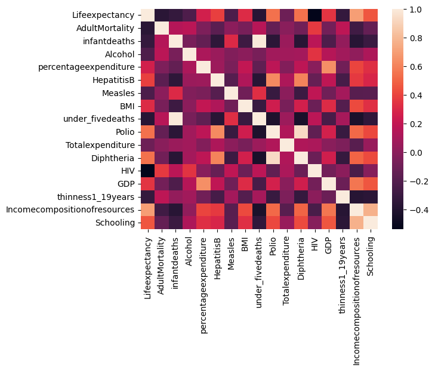

## Piechart
The piechart shows the the distribution of developed and developing countries in the Dataset
83% of the Countries are for Developing Countries and 17% are for Developed Countries
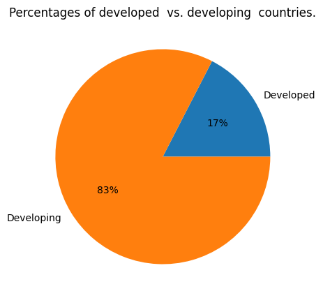

## Average GDP per African Countries over the Years
In figure above shows the average GDP per capita of African countries through out the years of 2000 until the year of 2015.

From the figure above there is a a slight dip in 2001 to 2002. This was because of the knock on effect of global economic slight down turn. This was caused by the lower world prices for the primary commodities that Africa exports. Also there was a reduced private capital flow most of which included foreign direct investment. 

This was then followed closely by a steep increase from 2002 to 2004 this was mainly brought about by more African countries industrializing and the return to normal pricing for the products made by African Counties. This led to African exports growing significantly. 

There was also a dip in 2004 and 2005 mostly due to the world import demand reducing.This greatly affected most African countries which are mostly raw material exporters. This reduced global demand saw a reduction in GDP per capita because african countries were earning less despite a huge growth in population. 

There was a steep increase in the years between 2005 to 2008 this was mainly due to a combination of factors such as the governments spending more on education and industrialization. There was also the strong uptick of internet and technology across Africa and global demand for raw material which most African countries are a net explorer of. 
The GDP per capita then took a sharp decline from 2007 to 2010  this was a knock on effect of the subprime mortage crisis in the United States and this had a knock on effect on global economies. This meant that most countries greatly reduced their imports and this greatly affected the GDP of most African countries. It then grew between 2010 and 2011 and then fell from the years 2012 to 2013 and then rose from 2013 to 2015 showing a positive trend

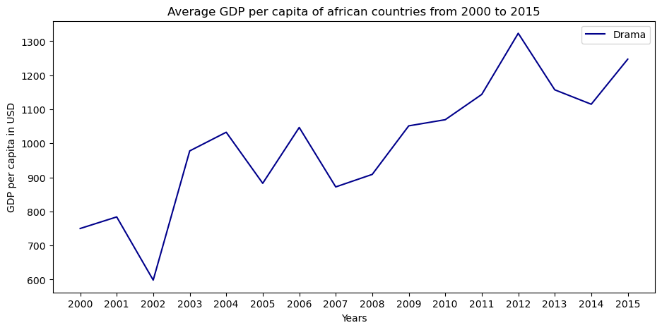

## Average Life Expectancy for African Countries over the Years
From the years of 2002 and 2003 there is a slight decrease in the average life expectancy in the continent. This was due to a combination of factors. Between the time period there was a huge drought in the region and mostly in the Horn Of Africa which saw milions affeted. HIV/AIDS also played a huge factor in reducing life expectancy

In 2004 and 2007 there was an increase in Life expectancy as more and more countries invested in health care and eduction of the public. This led to reduce in harmful practices and sensitaization on matters AIDS. The continued investment in health by African countries led to an increase in people being able to afford healthcare and this led to an increase in Average Life Expectancy.

The graph shows a major life expectancy increase and this is mostly because of education and increased spending by the governments on healthcare this greatly increases the quality and availability of people to get better healthcare.

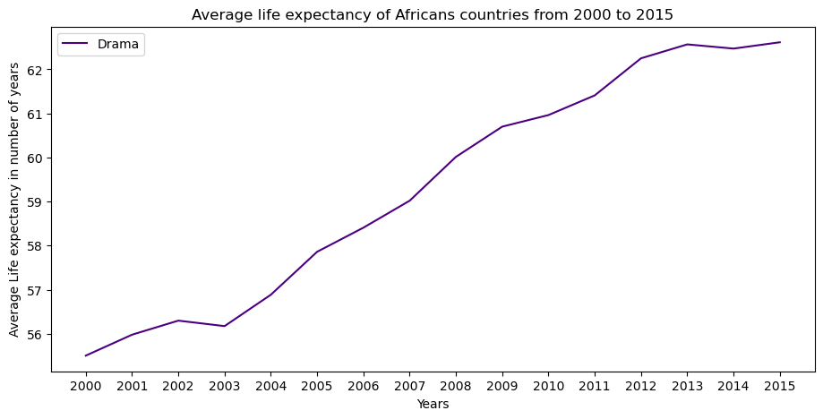

### Hypothesis 

### Immunization of Diseases and GDP

Null Hypothesis (H0) : There is no significant relationship  between a country’s immunization coverage and its GDP.

Alternative Hypothesis (H1): There is significant relationship between a country’s immunization coverage and its GDP

## Scatterplot for Polio

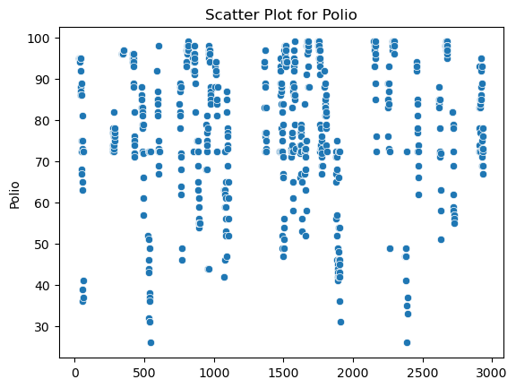
## Scatterplot for Measles

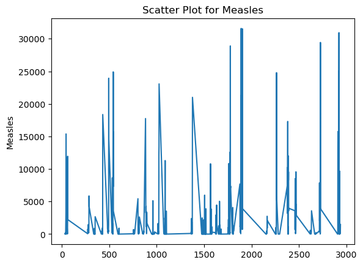

## Scatterplot for Hepatitis B
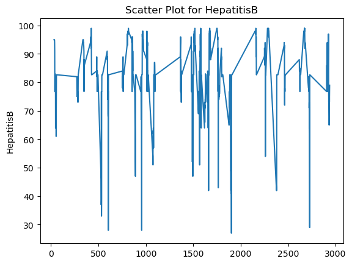
## Scatterplot for Diphtheria

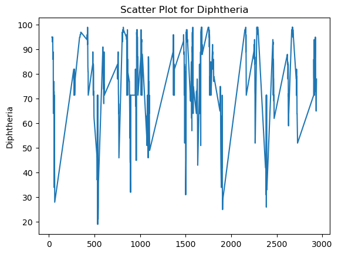

## Linear Regression between GDP and Polio
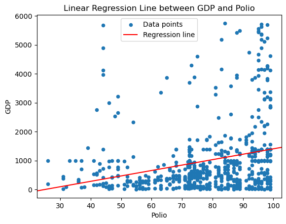
## Linear Regression between GDP and Measles

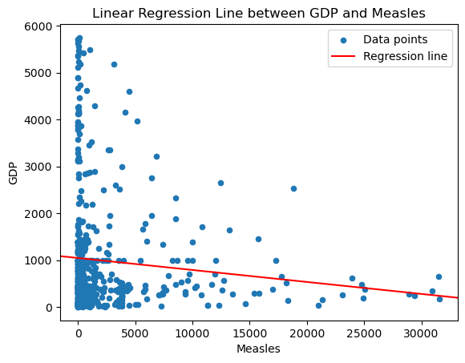
## Linear Regression between GDP and HepatitisB

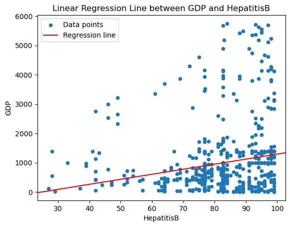
## Linear Regression between GDP and Diphetheria

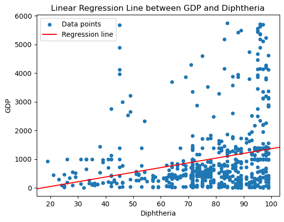
## Scatterplot with Regression Line of Alcohol and  GDP
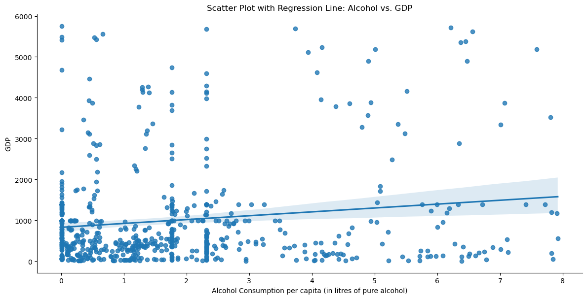
## Scatterplot with Regression Line of Schooling and  GDP

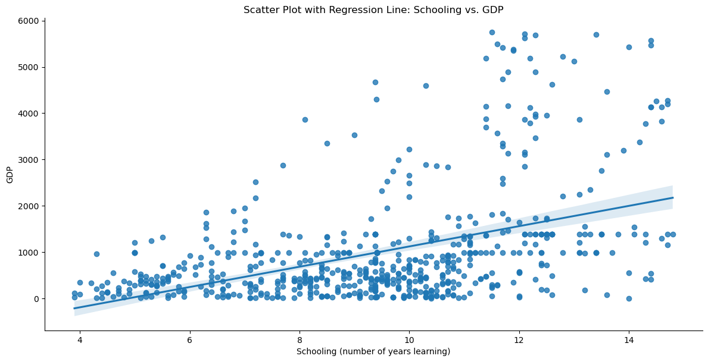
## Scatterplot with Regression Govt Health Expenditure and  GDP

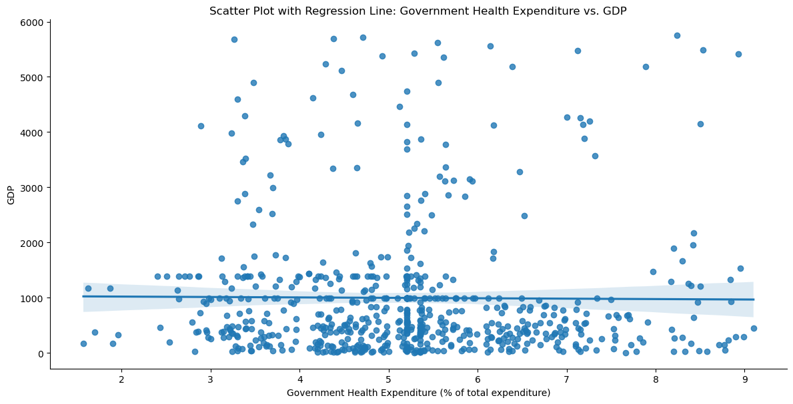
## Residual Plot Govt Health Expenditure and  GDP
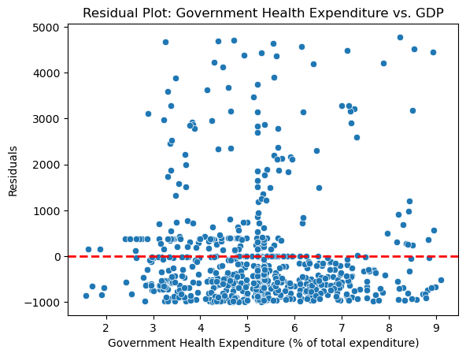

### Immunization of Diseases and GDP

For the hypothetical testing of relationship between GDP and government expenditure we found that based on the statistical study, there is no significant relationship between government health expenditure and GDP in the provided data. The linear regression model provides insufficient evidence to indicate a link between these variables.Thus we failed to reject the null hypothesis.

For the hypothetical testing of the relationship between Alcohol Consumption and GDP we found that we can reject the null hypothesis. This is because we can determine that there is a significant relationship between Schooling and GDP and this means hypothesis h1 stands based off of the f_pvalue.

For the hypothetical testing of the relationship between GDP and Immunizations (Polio, Diphtheria, Hepatitis B, Measles) we found that we can reject null hypothesis since the f_pvalue was lower than the significance level thus we will rejected the Null Hypothesis.

### Recommendations:

Given that immunization may not have a direct impact on GDP in african countries as observed in the dataset,the investors are thus advised to diversify their portfolios across various sectors and industries. This can help mitigate risks associated with specific factors.

While the test may not show a large significant association between Immunization and GDP however a healthier population can contribute to increased productivity and workforce participation over time thus it is recommended to invest in african countries that have more of its citizens being immunized.

Its advisable to invest in african countries that have improved schooling since there is a significant statistal relationship between the two thus theres a higher chance of your investment having positibe returns
